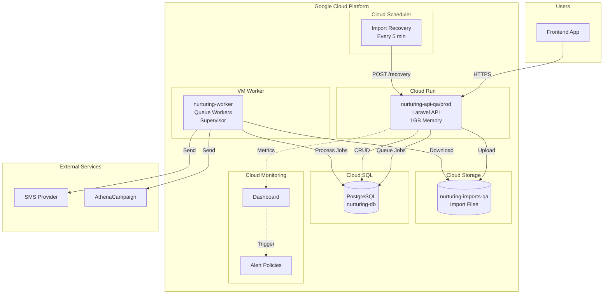
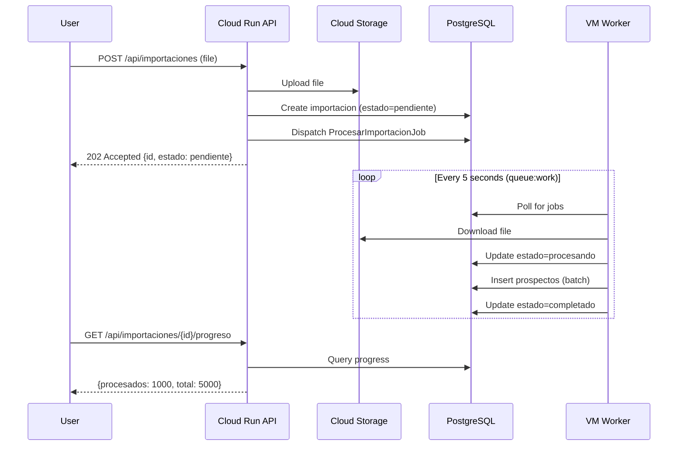
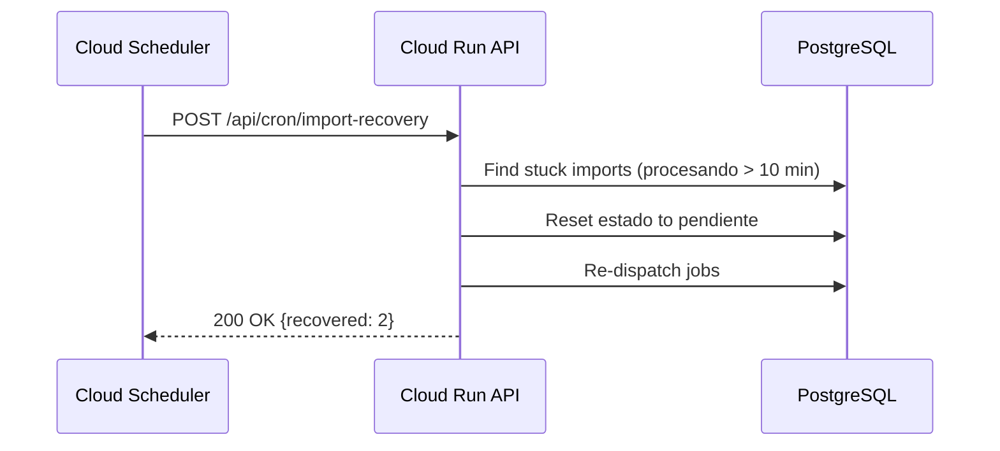

# Nurturing Backend Architecture

## System Overview

## Deployment Targets

| Component | Platform | Memory | Scaling |
|-----------|----------|--------|---------|
| API | Cloud Run | 1GB | 0-10 instances |
| Workers | VM (e2-medium) | 4GB | 2 workers via Supervisor |
| Database | Cloud SQL | - | PostgreSQL 15 |
| Storage | Cloud Storage | - | nurturing-imports-{env} |

## Request Flow: Import Processing

## Recovery Flow

## Key Design Decisions

### Why Hybrid Cloud Run + VM?

1. **Cloud Run for API**: Scales to zero, pay-per-request, handles traffic spikes
2. **VM for Workers**: Long-running processes, no cold starts, consistent memory

### Why Background Processing for ALL Imports?

- `DIRECT_PROCESSING_THRESHOLD_BYTES = 0` forces all imports to queue
- Prevents Cloud Run 504 timeouts (60s limit)
- Allows progress tracking and recovery

### Why Database Queue (not Redis)?

- Simpler infrastructure (no Redis to manage)
- Transactional safety with PostgreSQL
- Good enough for current scale (~100 jobs/day)

## Environment Variables

See `CLAUDE.md` for the complete list of required environment variables per target.

## Monitoring Endpoints

| Endpoint | Purpose |
|----------|---------|
| `GET /api/importaciones/health` | Import system health check |
| `POST /api/cron/import-recovery` | Trigger stuck import recovery |

## Related Documentation

- [Runbook: Stuck Imports](runbooks/stuck-imports.md)
- [Runbook: 504 Timeouts](runbooks/504-timeouts.md)
- [Runbook: VM Workers](runbooks/vm-workers.md)
